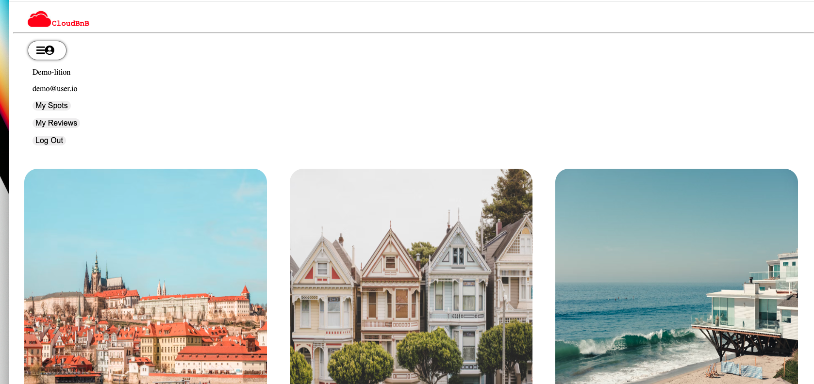

# About CloudBnB
CloudBnB is a web application inspired by Airbnb, that offers an online platform for renting, primarily short-term transition staying for vocation rentals, and tourism activiies.
[This is the CloudBnb Live Site](https://airbnblyn.herokuapp.com/)

Please see below links to project Wiki:

[API Routes](https://github.com/linyangofmay/AirBnB/wiki/CloudBnB-API-Routes)

[feature list](https://github.com/linyangofmay/AirBnB/wiki/CloudBnb-feature-list)

[Database Schema Image](https://github.com/linyangofmay/AirBnB/wiki/Database-Schema-Image-with-Relationships)

[Redux State Shape](https://github.com/linyangofmay/AirBnB/wiki/Redux-State-Shape)

# List of technologies used on the project

This project is built with :
- Javascript
- PostgreSQL
- Sequelize
- Express
- React
- Redux

Feature Directions:
Home Page Demo User:
You will be able to test the features without sign up by cliking on the `Demo User` button

